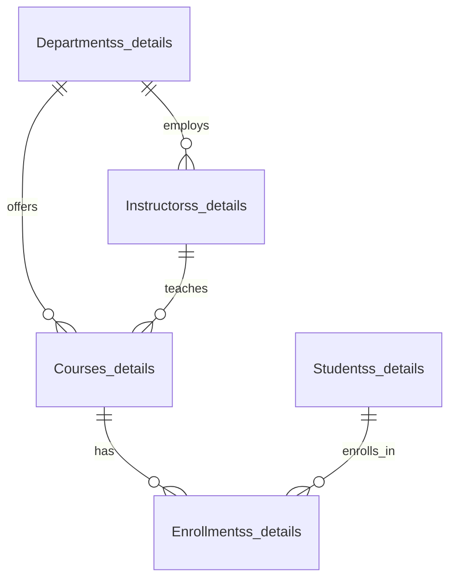

# FINAL-PR-UNIVERSITY-COURSE-MANAGAMENT-
 <div align="center">

# 🎓 University Course Management System
### *A complete SQL-powered academic ecosystem — students, courses, instructors, all in one place* 🏛️


> 💭 *"Just storing data isn't enough — the real skill lies in **querying it, understanding it, and turning it into a story**."*

[](#)

</div>

---

## 📑 Table of Contents

- [🧭 At a Glance](#-at-a-glance)
- [🗺️ ER Diagram (Relationships)](#️-er-diagram-relationships)
- [🧩 What's Inside](#-whats-inside)
- [📂 Folder Structure](#-folder-structure)
- [🛠️ Tech Stack](#️-tech-stack)
- [🚀 Getting Started](#-getting-started)
- [🔍 Sample Queries](#-sample-queries)
- [🧠 Key Learnings](#-key-learnings)
- [📌 Future Scope](#-future-scope)
- [🤝 Contributing](#-contributing)

---

## 🧭 At a Glance

This project simulates a **University's database backbone** — where Students, Courses, Instructors, Departments, and Enrollments are all interconnected, following real-world relational logic.

| 🏷️ Entity | 📄 Table Name | 🔗 Relationship |
|---|---|---|
| 👨‍🎓 Students | `Studentss_details` | Linked to Courses through Enrollments |
| 📚 Courses | `Courses_details` | Linked to Departments |
| 👩‍🏫 Instructors | `Instructorss_details` | Linked to Departments |
| 🏢 Departments | `Departmentss_details` | Root entity |
| 📝 Enrollments | `Enrollmentss_details` | Bridge table — Students ↔ Courses |

---

## 🗺️ ER Diagram (Relationships)



*(Department is the root entity — Courses and Instructors both branch from it, while Enrollments bridges Students to Courses.)*

---

## 🧩 What's Inside

### 🏗️ Schema Architecture
5 interconnected tables — built with foreign keys, following proper relational structure.

### 🔄 The Full CRUD Cycle
**Create → Read → Update → Delete** operations implemented for every table (Students, Courses, Instructors, Enrollments, Departments).

### 🔍 Query Arsenal
- 📅 Date-based filtering (students enrolled after 2022)
- 🔗 INNER & LEFT JOINS
- 📊 Aggregations — `COUNT`, `AVG`, `MAX`, `SUM`
- 🧮 Subqueries (nested logic)
- 🪟 Window Functions — Running Total via `OVER()`, `RANK()`, `ROW_NUMBER()`
- 🏷️ `CASE`-based labelling (Senior vs Junior students)
- ✂️ String operations — `CONCAT`, `EXTRACT`, `UPPER`/`LOWER`
- 🧹 `GROUP BY` + `HAVING` filters for grouped conditions

### 🎯 Real-World Style Questions Solved
- Finding students enrolled in more than one course
- Getting department-wise student counts
- Identifying high-salary instructors
- Finding course-wise average enrollment trends
- Top-performing department by student strength

---

## 📂 Folder Structure

```
📦 UniversityCourseManagement
 ┣ 📜 schema.sql          → Table creation + relationships
 ┣ 📜 sample_data.sql     → Dummy data insert scripts
 ┣ 📜 crud_operations.sql → Create/Read/Update/Delete queries
 ┣ 📜 queries.sql         → Joins, subqueries, window functions, CASE
 ┗ 📜 README.md           → You're here 😄
```

---

## 🛠️ Tech Stack

<div align="center">


</div>

---

## 🚀 Getting Started

1. 🗄️ Create a `UniversityCourseManagement` database in PostgreSQL
2. 📥 Run the full `.sql` script — tables will auto-create and sample data will be inserted
3. 🔎 Explore the query sections below — each one is labelled with a comment

```sql
-- Example: See the top courses by enrollment
SELECT c.CourseName, COUNT(e.StudentID) AS StudentCount
FROM Courses_details c
JOIN Enrollmentss_details e ON c.CourseID = e.CourseID
GROUP BY c.CourseName
ORDER BY StudentCount DESC;
```

---

## 🔍 Sample Queries

```sql
-- 1️⃣ Students enrolled in more than one course
SELECT StudentID, COUNT(CourseID) AS CoursesEnrolled
FROM Enrollmentss_details
GROUP BY StudentID
HAVING COUNT(CourseID) > 1;

-- 2️⃣ Department-wise total students
SELECT d.DepartmentName, COUNT(s.StudentID) AS TotalStudents
FROM Departmentss_details d
JOIN Studentss_details s ON d.DepartmentID = s.DepartmentID
GROUP BY d.DepartmentName;

-- 3️⃣ Running total of enrollments (Window Function)
SELECT CourseID, COUNT(*) OVER (ORDER BY CourseID) AS RunningTotal
FROM Enrollmentss_details;

-- 4️⃣ Senior vs Junior student labelling
SELECT StudentName,
       CASE WHEN EXTRACT(YEAR FROM AGE(EnrollmentDate)) >= 2 
            THEN 'Senior' ELSE 'Junior' END AS StudentType
FROM Studentss_details;
```

---

## 🧠 Key Learnings

- Multi-table relational design with proper foreign key constraints
- Real-world CRUD lifecycle across all entities
- Writing production-style analytical queries (joins + window functions together)
- Thinking in terms of "business questions" and converting them into SQL logic

---

## 📌 Future Scope

- 🧑‍💼 Build views for quick reporting
- ⏱️ Add triggers for audit-logging
- 📈 Add indexing for performance optimization
- 🌐 Connect a simple dashboard (Python/Streamlit) for visualization
- 🔐 Role-based access control (Admin/Instructor/Student views)

---

## 🤝 Contributing

Suggestions and improvements are always welcome! Feel free to fork, open an issue, or send a PR. 🙌

---

<div align="center">

### 👩‍💻 Crafted by Kavita Khushalani

> 💭 *"Writing a query is easy, but asking the **right question** is real engineering."*


</div>
